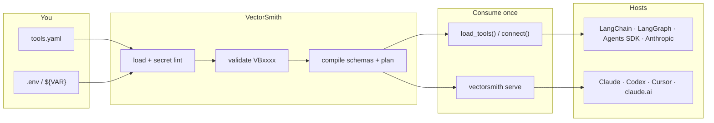

<div align="center">


# VectorSmith

**Your vector database, forged into tools an agent can actually use.**

Write a `tools.yaml`. VectorSmith compiles it into typed, tenant-guarded tools — then you either `import` them in Python or `serve` them over MCP.

[](LICENSE)
[](pyproject.toml)
[](docs/tools-yaml-reference.md)
[](docs/integrations/README.md)
[](https://kjgpta.github.io/vectorsmith/)

[What it is](#why-this-exists) · [How it works](#how-it-works) · [Write YAML](#write-a-tool-not-a-prompt) · [Python](#in-your-agent-python) · [Claude / Codex / Cursor](#in-claude-codex-cursor) · [Try it](#try-it) · [**Docs**](https://kjgpta.github.io/vectorsmith/)

</div>

---

## Why this exists

Agents that talk to *your* invoices, tickets, or catalog usually get one of two bad options:

| Typical approach | What goes wrong |
|---|---|
| Vendor MCP (Qdrant / Pinecone / …) | Cluster admin tools. Upsert, delete, create-collection. The model can wander. |
| Hand-bind JSON schemas to LangChain / the OpenAI SDK | You re-implement filters, limits, and tenant isolation in Python. Every agent copies it. |
| “Just embed and `search()` in the system prompt” | No typed args. No enums. No hidden `tenant = acme`. |

VectorSmith is the third option: **the data store stays yours. The tools are a YAML contract.** The compiler turns that contract into MCP schemas or in-process tools. The agent never sees the URL, the API key, or the tenant filter.

```text
  you write                         VectorSmith                    the agent sees
─────────────                   ─────────────────                ────────────────
 tools.yaml          ──▶   interpolate → validate → compile  ──▶  search_invoices
 tenant: acme                    Engine stays internal            query, client, status
 ${QDRANT_URL}                                                    (no tenant, no URL)
```

---

## How it works



One file, two doors. Same compiled tools.

<div align="center">

| | **Python app** | **Chat / IDE host** |
|---|---|---|
| Install | `pip install "vectorsmith[qdrant,langchain]"` | `pip install "vectorsmith[qdrant]"` so `vectorsmith` is on `PATH` |
| Call | `from vectorsmith import load_tools` | `vectorsmith serve tools.yaml --name invoices` |
| Process | In-process. No subprocess. | The host **spawns** the CLI (MCP stdio or HTTP) |
| Mix-in | Your `@tool`s + Slack/GitHub via an MCP client | Other `mcpServers` keys sit next to it |

</div>

You do **not** import an executor. You do **not** copy `inputSchema` into the LLM SDK.

---

## Write a tool, not a prompt

A tool is a name, a description (so the model *picks* it), a collection, optional text search, parameters the model may pass, and filters it **must never** see:

```yaml
tds_version: "1"

connections:
  invoices:
    backend: qdrant
    url: ${QDRANT_URL}              # secrets only here, only as ${VAR}
    api_key: ${QDRANT_API_KEY:-}

tools:
  - name: search_invoices
    kind: search
    description: >
      Search invoices by free text and filter by client, status, or amount.
      Use when the user asks about invoices, billing, or payments.
    target: { connection: invoices, collection: invoices }
    query: { param: query, required: false }
    static_filters:
      - { path: tenant, op: eq, value: acme }    # hidden from the model
    parameters:
      - { name: client, path: client_name, dtype: keyword, op: eq }
      - { name: status, path: status, dtype: keyword, op: in,
          enum: [draft, sent, paid, overdue] }
      - { name: min_amount, path: amount, dtype: float, op: gte }
    output:
      fields: [invoice_id, client_name, status, amount]
      limit_default: 10
      limit_max: 50
```

`vectorsmith init ./demo` writes a starter file. The full field list — kinds, operators, pipelines, built-ins, every backend — is in **[docs/tools-yaml-reference.md](docs/tools-yaml-reference.md)**.

### What the model sees

```json
{
  "name": "search_invoices",
  "description": "Search invoices by free text and filter by client, status, or amount. …",
  "inputSchema": {
    "type": "object",
    "properties": {
      "query": { "type": "string" },
      "client": { "type": "string" },
      "status": {
        "type": "array",
        "items": { "type": "string", "enum": ["draft", "sent", "paid", "overdue"] }
      },
      "min_amount": { "type": "number" },
      "limit": { "type": "integer", "minimum": 1, "maximum": 50, "default": 10 }
    }
  }
}
```

`tenant: acme` is **not** in that schema. The engine ANDs it on every call. Credentials never leave `connections`.

### Kinds you can declare

| `kind` | For | Typical tool |
|---|---|---|
| `search` | Semantic retrieve + filters | `search_invoices` |
| `lookup` | Exact id, limit 1 | `get_invoice` |
| `count` | “How many overdue?” | `count_invoices` |
| `scroll` | Filter / page, no ANN | list-style tools |
| `pipeline` | Retrieve → `post_filter` / `group_by` / `sort` / `project` | top-N per client |

Built-ins (`search_<connection>`, `get_<connection>_by_id`, …) are **opt-in** on the connection. Turn them off if you already named a user tool the same way.

---

## In your agent (Python)

```bash
pip install "vectorsmith[qdrant,langchain]"
```

```python
from vectorsmith import load_tools
from langchain.agents import create_agent

tools = load_tools("tools.invoices.yaml", "tools.tickets.yaml")
agent = create_agent("openai:gpt-4.1", tools)
# … await tools.aclose()
```

Same YAML, other stacks:

```python
from vectorsmith.langgraph import load_tools      # create_react_agent / ToolNode
from vectorsmith.openai_agents import load_tools  # Agent + Runner
from vectorsmith.anthropic import load_tools      # messages.create(tools=vs.tools)
from vectorsmith import connect                   # await vs.call("search_invoices", {…})
```

| Extra | Import |
|---|---|
| `vectorsmith[langchain]` | `from vectorsmith import load_tools` |
| `vectorsmith[langgraph]` | same tools; LangGraph graph |
| `vectorsmith[openai-agents]` | `from vectorsmith.openai_agents import load_tools` |
| `vectorsmith[anthropic]` | `from vectorsmith.anthropic import load_tools` |

Worked apps: [`examples/langchain_agent`](examples/langchain_agent/) · [`langgraph_agent`](examples/langgraph_agent/) · [`openai_agents`](examples/openai_agents/) · [`anthropic_agent`](examples/anthropic_agent/).

---

## In Claude, Codex, Cursor

Those products cannot `import vectorsmith`. They spawn a process. Point them at `serve` with the **same YAML**.

```json
{
  "mcpServers": {
    "invoices": {
      "command": "vectorsmith",
      "args": ["serve", "tools.invoices.yaml", "--name", "invoices"]
    }
  }
}
```

Codex is TOML (`~/.codex/config.toml`), not JSON. Claude Code uses `.mcp.json` — it does **not** read the Desktop file.

| Host | Config | Guide |
|---|---|---|
| Claude Desktop | `claude_desktop_config.json` | [docs/integrations/claude-desktop.md](docs/integrations/claude-desktop.md) |
| Claude Code | `.mcp.json` / `claude mcp add` | [docs/integrations/claude-code.md](docs/integrations/claude-code.md) |
| OpenAI Codex | `~/.codex/config.toml` | [docs/integrations/openai-codex.md](docs/integrations/openai-codex.md) |
| Cursor | `.cursor/mcp.json` | [docs/integrations/cursor.md](docs/integrations/cursor.md) |
| claude.ai | `serve --http --auth builtin` | [docs/quickstart-selfhost.md](docs/quickstart-selfhost.md) |

Copy-paste snippets: [`examples/mcp_hosts/`](examples/mcp_hosts/). Slack, GitHub, filesystem stay **separate** servers — [coexistence](docs/coexistence.md).

---

## Stores

`backend` on a connection is one of six shipped adapters. Full matrix (extras, hybrid, nested paths): **[vector stores](docs/vector-stores.md)**.

`qdrant` · `pgvector` · `chroma` · `pinecone` · `weaviate` · `milvus`

pgvector can run in **table mode** (no vector column) for lookup / count / scroll. Hybrid search is capability-gated (Qdrant / Weaviate / Milvus / Pinecone) and checked with `validate --live`.

---

## Try it

The invoice example is a `tools.yaml` plus an env file. Copy `.env.example` and set `QDRANT_URL` to **your** cluster before `validate` / `test` / `serve`.

```bash
# clone, then:
uv sync

uv run vectorsmith validate examples/qdrant_invoices/tools.invoices.yaml \
  --env-file examples/qdrant_invoices/.env.example

uv run vectorsmith test examples/qdrant_invoices/tools.invoices.yaml search_invoices \
  --args '{"query":"Globex invoice","limit":3}' \
  --env-file examples/qdrant_invoices/.env.example

uv run vectorsmith serve examples/qdrant_invoices/tools.invoices.yaml --name invoices \
  --env-file examples/qdrant_invoices/.env.example
```

Tickets are a second file / second MCP name: `tools.tickets.yaml` → `--name tickets`.

[Example walkthrough](examples/README.md)

---

## CLI

| Command | Does |
|---|---|
| `init` | Write a starter `tools.yaml` + `.env.example` |
| `validate` | Compile + lint. `--live` pings the store. `--strict` fails on warnings |
| `test` | Call one compiled tool without serving |
| `serve` | MCP stdio (Desktop / Codex / Cursor; `--watch` on by default) or `--http HOST:PORT` (no watch). Default HTTP `--auth` is `builtin` (needs `https` `--public-url`). Localhost HTTP: `--auth none`. |
| `introspect` | Collection / field metadata to `--out` (default `schema.json`). Requires `--connection`. |
| `drafts` / `approve` | `drafts list\|reject NAME`. `approve NAME [--file tools.yaml]` promotes into that file. Drafts live in `./tools.drafts.yaml` (process cwd). |
| `auth` | `rotate-secret` \| `revoke` for builtin HTTP OAuth |

`validate` exits `0` / `1` (`--strict` warnings) / `2` (errors). `test` and `introspect` use `3` on a live failure. `serve --http --auth none` off localhost exits `3`.

---

## Documentation

**[kjgpta.github.io/vectorsmith](https://kjgpta.github.io/vectorsmith/)** is the rendered manual (Material for MkDocs). Source is [`docs/`](docs/index.md).

| I want to… | Go here |
|---|---|
| Get a tool working in five minutes | [Getting started](docs/getting-started.md) |
| See which vector stores ship | [Vector stores](docs/vector-stores.md) |
| Understand every `tools.yaml` field | [YAML reference](docs/tools-yaml-reference.md) |
| Plug into Claude, Codex, Cursor, LangChain, … | [Integrations](docs/integrations/README.md) |
| Look up a CLI flag | [CLI](docs/cli.md) |
| Call tools from Python | [Python API](docs/python-api.md) |
| Fix Desktop disconnect / env / HTTP auth | [FAQ](docs/faq.md) |
| Copy a host config | [examples/mcp_hosts](examples/mcp_hosts/) |
| See agent apps | [examples/](examples/README.md) |

---

## Develop

```bash
uv sync
uv run ruff check .
uv run pytest -m "not conformance"
uv run lint-imports
```

Workspace: `packages/core` (`vectorsmith_core`, unpublished) · `packages/cli` (published `vectorsmith`). Core must not import the CLI.

[Contributing](CONTRIBUTING.md) · [Support](SUPPORT.md) · [Security](SECURITY.md) · [Changelog](CHANGELOG.md) · [Code of conduct](CODE_OF_CONDUCT.md)

---

<div align="center">

Apache-2.0 · [LICENSE](LICENSE) · [NOTICE](NOTICE)

*Forge the tools. Keep the store.*

</div>
