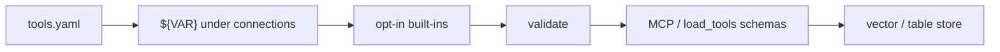

# tools.yaml

Hub: [documentation home](index.md). This page is the **field-by-field contract**. For a walkthrough, see [getting started](getting-started.md).

VectorSmith’s project config is a YAML file. The conventional name is **`tools.yaml`**. You can call it anything (`tools.invoices.yaml`, `billing.yml`) — the CLI and `load_tools` take the path you pass.

The file is a **Tool Definition Schema (TDS)**. It declares:

1. How to reach a data store (`connections`)
2. Which **read-only** tools an agent may call (`tools`)
3. Guardrails the model never sees (`static_filters`, limits, field projection)

You do not write Python for those tools. VectorSmith compiles the YAML into MCP schemas (for Claude / Codex / Cursor) or in-process tools (`load_tools` / `connect`). Same file, both paths — [integrations](integrations/README.md).

```bash
vectorsmith init ./demo          # writes tools.yaml + .env.example
vectorsmith validate tools.yaml --env-file .env
vectorsmith test tools.yaml search_invoices --args '{"query":"Globex","limit":3}'
```

Worked files: [`examples/qdrant_invoices/tools.invoices.yaml`](https://github.com/kjgpta/vectorsmith/tree/main/examples/qdrant_invoices/tools.invoices.yaml), [`tools.tickets.yaml`](https://github.com/kjgpta/vectorsmith/tree/main/examples/qdrant_invoices/tools.tickets.yaml).

---

## How VectorSmith uses the file

On `validate`, `serve`, `test`, `load_tools`, or `connect`:

1. **Read** — Safe YAML only. Max 1 MB, depth 20, 100 anchors. Root must be a mapping.
2. **Interpolate** — `${VAR}` and `${VAR:-default}` are replaced **only** under `connections`. Anywhere else, a `${…}` string is an error (`VB1003`). The env map is: CLI `--env-file` only; Python `os.environ` + `env=` + `env_file=`.
3. **Lint secrets** — Literal API keys, DSNs with passwords, high-entropy strings under `connections` fail load. Put secrets in the environment or `--env-file`.
4. **Parse** — Pydantic models (`tds_version: "1"`). Unknown keys are kept as **warnings** (`VB0001`), not hard errors.
5. **Synthesize built-ins** — Opt-in `builtin_tools` become extra tools (`search_<connection>`, …). They never appear as entries you typed under `tools:`.
6. **Validate** — Names, kinds, dtype×op, backend capabilities, hybrid, pipelines. All issues are collected (`VBxxxx`).
7. **Compile** — Each tool becomes an MCP `inputSchema` plus an execution plan (filters, embedding, limits).

The agent only sees the compiled schema (name, description, parameters). It does not see `static_filters`, connection URLs, or credentials.



---

## Minimal file

```yaml
tds_version: "1"

connections:
  invoices:
    backend: qdrant
    url: ${QDRANT_URL}
    api_key: ${QDRANT_API_KEY:-}

tools:
  - name: search_invoices
    kind: search
    description: >
      Search invoices by free text and filter by client or status.
      Use when the user asks about invoices, billing, or payments.
    target: { connection: invoices, collection: invoices }
    query: { param: query, required: false }
    parameters:
      - { name: client, path: client_name, dtype: keyword, op: eq }
```

`vectorsmith init` writes a slightly richer starter (built-ins on, sample search tool).

---

## Top-level keys

| Key | Required | Meaning |
|---|---|---|
| `tds_version` | yes | Must be `"1"`. |
| `connections` | yes | Named stores. A tool’s `target.connection` must be one of these keys. |
| `tools` | no | User-authored tools. Empty is valid if you only enable built-ins. |
| `defaults` | no | Default embedding model. |
| `authoring` | no | Allow Claude to *draft* new tools (`define_tool`). Drafts never write this file until `vectorsmith approve`. |

One file = one project = one `serve --name` (one MCP connector) or one `load_tools(...)` source. Two collections you want as separate connectors → two files (this repo: invoices + tickets).

---

## Connections

Each entry is a named handle. Tools point at it; they do not repeat URLs.

```yaml
connections:
  invoices:
    backend: qdrant
    url: ${QDRANT_URL}
    api_key: ${QDRANT_API_KEY:-}
```

### Secrets

Allowed **only** under `connections`:

| Form | Result |
|---|---|
| `${QDRANT_URL}` | Required. Missing → load fails (`MissingEnvError`). |
| `${QDRANT_API_KEY:-}` | Optional; empty string if unset. |
| `${QDRANT_URL:-http://localhost:6333}` | Default if unset. |
| `https://…?key=sk-live-…` | Rejected (looks like an inline secret). |

CLI: `--env-file .env` (only keys in that file — the process environment is **not** merged). Python: `load_tools(..., env_file=".env")` or `env={"QDRANT_URL": "…"}` **does** merge `os.environ`, then `env`, then the file.

### Backend fields

`backend` is the discriminator.

| `backend` | Required fields | Optional |
|---|---|---|
| `qdrant` | `url` | `api_key` |
| `pgvector` | `dsn` | `table`, `vector_column` (default `embedding`), `mode` (`vector` \| `table`), `id_column` (default `id`) |
| `chroma` | `url` | `auth_token` |
| `pinecone` | `api_key`, `host` | `namespace` |
| `weaviate` | `url` | `api_key`, `tenant` |
| `milvus` | `uri` | `token`, `user`, `password`, `database` |

**pgvector table mode** — `mode: table` or `vector_column: null`. No vector column, so `kind: search` and `query:` are rejected (`VB2016`). Use `lookup` / `count` / `scroll` / `pipeline`.

Every connection also accepts `builtin_tools` and `builtin_defaults` (below).

### Many connections in one file

```yaml
connections:
  invoices:
    backend: qdrant
    url: ${QDRANT_URL}
  warehouse:
    backend: pgvector
    dsn: ${PG_DSN}
    table: invoices
    mode: table
```

That is still **one** MCP server. Each tool picks one `target.connection`. Two connector names in Claude → two YAML files and two `serve --name` processes.

---

## Built-in tools (opt-in)

All four default to **false**. Enable only what you want. Names are derived from the **connection key**, not the collection.

| Flag | Synthesized tool | Kind |
|---|---|---|
| `semantic_search` | `search_<name>` | search, required `query` |
| `get_by_id` | `get_<name>_by_id` | lookup, required `id` |
| `count` | `count_<name>` | count |
| `list_collections` | `list_<name>_collections` | meta |

```yaml
connections:
  main:
    backend: qdrant
    url: ${QDRANT_URL}
    builtin_tools:
      semantic_search: true
      get_by_id: true
    builtin_defaults:
      collections: [invoices]    # one name ⇒ no collection argument
      static_filters:
        - { path: tenant, op: eq, value: acme }
      output: { limit_default: 10, limit_max: 50 }
      descriptions:
        semantic_search: >
          Search ACME invoices by meaning when no more specific tool fits.
```

`builtin_defaults.collections`:

- **One** name — collection is fixed; no `collection` parameter.
- **Several** names — required `collection` enum.
- **Omitted** — required free-string `collection`.

If you also write a user tool named `search_main` while `semantic_search` is on, compile fails (`VB2010`). The invoice/ticket examples omit built-ins for that reason (`search_invoices` is a user tool).

Unrestricted `semantic_search` next to your own search tools warns (`VB3003`). Prefer tenant `static_filters` on built-ins (`VB3004`).

---

## `defaults`

```yaml
defaults:
  embedding: fastembed/BAAI/bge-small-en-v1.5
```

TDS default for this key is `fastembed/BAAI/bge-small-en-v1.5`. At run time the executor uses the tool’s `query.embedding` if set, otherwise that same model string. A custom `defaults.embedding` is stored on the project but is **not** read by the compiler yet — set `query.embedding` on the search tool to override.

The collection’s vector size must match the model (the invoice example is 384-dim `BAAI/bge-small-en-v1.5`).

---

## `authoring`

```yaml
authoring:
  define_tool: true
```

Enables `describe_collection` and `define_tool` on `serve`. Equivalent: `vectorsmith serve … --enable-define` (either the YAML flag **or** the CLI flag is enough).

Claude can propose a tool; the server writes **`tools.drafts.yaml` in the process working directory** (set `cwd` in Desktop/Codex). Cap **10** pending drafts; pending drafts older than **30 days** expire. Promote with `vectorsmith approve NAME [--file tools.yaml]` (that is the only path that edits `tools.yaml`). `approve` interpolates connections with an empty env map — use `${VAR:-default}` in that file or interpolation fails.

`kind: meta` is never user-authorable.

---

## Tools

```yaml
tools:
  - name: search_invoices
    kind: search
    description: >
      Search invoices by free text and filter by client, status, or amount.
      Use when the user asks about invoices, billing, or payments.
    target: { connection: invoices, collection: invoices }
    query: { param: query, required: false }
    static_filters:
      - { path: tenant, op: eq, value: acme }
    parameters:
      - { name: client, path: client_name, dtype: keyword, op: eq }
      - { name: status, path: status, dtype: keyword, op: in,
          enum: [draft, sent, paid, overdue] }
      - { name: min_amount, path: amount, dtype: float, op: gte }
    output:
      fields: [invoice_id, client_name, status, amount]
      limit_default: 10
      limit_max: 50
```

### `name`

`^[a-z][a-z0-9_]{2,63}$` — unique in the file. Blocked if a built-in of that name is enabled (`VB2010`). Also reserved (even if not advertised today): `ping`, `define_tool`, `describe_collection`, `list_available_tools`, `run_tool`, `list_my_connections`, `get_started`.

`serve` always advertises `list_available_tools` and `run_tool` **in addition to** your compiled tools. With authoring on, it also advertises `describe_collection` and `define_tool`.

### `description`

20–1024 characters (hard). Aim for **when to pick this tool**, not a restatement of the name. Under 40 characters or “same as the name” → warnings (`VB3001`, `VB3002`). Claude / Codex choose among tools by this text.

### `kind`

| Kind | Purpose | Shape |
|---|---|---|
| `search` | Semantic (or filter-only) retrieve | `target` required; `query` optional |
| `lookup` | Fetch by exact key | `target`; no `limit` arg on the schema. `output.limit_default` other than 1 warns (`VB2006`) but is not rewritten |
| `count` | Count matching rows | `target`; no row payload |
| `scroll` | Filter / page without ANN | `target`; no `query` |
| `pipeline` | Retrieve then in-process steps | `steps` required; **no** `target` on the tool |
| `meta` | Built-in only (`list_*_collections`) | User files cannot declare this (`VB2014`) |

Default `kind` is `search`.

### `target`

```yaml
target: { connection: invoices, collection: invoices }
```

`connection` must exist. `collection` is a string for user tools (dynamic collection params are synthesis-only, `VB2015`).

### `query`

Present = this tool can take a text string and embed it.

| Field | Default | Meaning |
|---|---|---|
| `param` | `query` | Argument name on the compiled schema |
| `required` | `false` | If false and omitted at call time → filter-only retrieve |
| `embedding` | `defaults.embedding` | Model id |
| `mode` | `dense` | `dense` or `hybrid` |
| `alpha` | `0.5` | Hybrid mix, 0–1 |

`mode: hybrid` needs a backend with hybrid (Qdrant, Weaviate, Milvus, Pinecone) **and** sparse vectors on the collection. Confirm with `vectorsmith validate --live` (`VB2012` / `VB2013`). Chroma and pgvector do not support hybrid.

### `parameters`

Up to 12. Each becomes an argument on the tool schema. If the caller omits an optional param, that filter is dropped.

| Field | Rule |
|---|---|
| `name` | `^[a-z][a-z0-9_]{0,31}$`, unique per tool |
| `path` | Payload / column path, up to 3 segments (`client_name`, `meta.region`). Nested paths require a backend that supports them (not Chroma / Pinecone). |
| `dtype` | `keyword` · `integer` · `float` · `boolean` · `datetime` · `keyword[]` |
| `op` | See operators below |
| `required` | Default `false` |
| `description` | Shown on the compiled schema |
| `enum` | ≤ 100 values; steers the model. Unusual with ops other than `eq`/`ne`/`in`/`nin` (`VB2005`). |
| `default` | Compiled into the JSON schema |
| `max` | Upper bound for numeric params |

`in` / `nin` / `contains_*` compile as JSON arrays. `datetime` compiles as `string` + `format: date-time`.

### Operators

**Every backend:** `eq` `ne` `gt` `gte` `lt` `lte` `in` `nin`.

**Extended** (capability-gated, `VB2004` if the store cannot do it): `exists` `is_null` `contains_any` `contains_all` `like` `text_match`.

| dtype | Allowed ops |
|---|---|
| `keyword` | `eq` `ne` `in` `nin` `like` `text_match` |
| `integer` / `float` / `datetime` | `eq` `ne` `gt` `gte` `lt` `lte` `in` `nin` |
| `boolean` | `eq` `ne` |
| `keyword[]` | `in` `nin` `contains_any` `contains_all` |

Qdrant also allows `exists` / `is_null` / `text_match`. pgvector adds `like`. See `vectorsmith_core.adapters.capabilities` for the full matrix.

`filter_logic` is always `and` (the only legal value). Optional params that are absent are not part of the AND.

### `static_filters`

Applied on **every** call. Not advertised to the model. Use for tenant / org isolation.

```yaml
static_filters:
  - { path: tenant, op: eq, value: acme }
  - { path: status, op: eq, value: overdue }   # named “overdue only” tool
```

Ops here are the LCD set (`eq` `ne` `gt` `gte` `lt` `lte` `in` `nin`). Values are literals, not `${VAR}` (interpolation is connections-only).

### `output`

| Field | Default | Meaning |
|---|---|---|
| `fields` | all returned | Projection the agent sees |
| `limit_default` | 10 | 1–500 |
| `limit_max` | 50 | 1–500 |
| `include_score` | `true` | Similarity score when the kind is a search |

For `search` / `scroll` / `pipeline`, VectorSmith adds a `limit` argument (integer, default/max from `output`). Lookup / count / meta do not get that argument.

---

## Pipeline tools

Use a pipeline when one retrieve is not enough: filter in-process, top-N per group, sort, project.

```yaml
  - name: top_overdue_by_client
    kind: pipeline
    description: >
      For each client, the largest overdue invoices, optionally matching a text query.
      Use when the user asks who owes the most past-due amount.
    steps:
      - retrieve:
          target: { connection: invoices, collection: invoices }
          query: { param: query, required: false }
          fetch: { k_param: limit, overfetch_factor: 10, max_candidates: 2000 }
      - post_filter: { expr: "amount > 0 AND days_overdue >= params.min_days" }
      - group_by:
          keys: [client_name]
          per_group: { sort_by: amount, desc: true, take: 3 }
      - sort: { by: amount, desc: true }
      - project: { fields: [client_name, invoice_id, amount, days_overdue] }
    parameters:
      - { name: min_days, dtype: integer, default: 30 }
    output:
      limit_default: 20
      limit_max: 100
    static_filters:
      - { path: tenant, op: eq, value: acme }
      - { path: status, op: eq, value: overdue }
```

Rules:

- First step **must** be `retrieve` (`VB2101`). The tool itself has no `target`.
- Later steps run in-process (Polars), not in the vector DB.
- After `post_filter`, if too few rows remain, the engine over-fetches (`overfetch_factor`, widen ×3, up to 3 attempts, cap `max_candidates`) and may set `may_be_incomplete` on the result so the model can caveat.
- Put the text argument on the **retrieve** step (`query.param` / `query.required`). `mode`, `alpha`, and `embedding` are taken from a **tool-level** `query:` if you set one; `retrieve.query.mode` is not compiled.

| Step | Fields |
|---|---|
| `retrieve` | `target`, optional `query`, optional `filter`, `fetch` |
| `post_filter` | `expr` (non-empty) |
| `group_by` | `keys` (1–3 paths), optional `per_group.{sort_by,desc,take}` |
| `sort` | `by`, `desc` (default true) |
| `project` | `fields` (at least one) |

`fetch`: `k_param` (default `limit`), `overfetch_factor` 1–50 (default 10), `max_candidates` 10–20000 (default 2000).

### `expr` (post_filter only)

Comparisons `== != > >= < <=`, `AND` `OR` `NOT`, arithmetic `+ - * /`, number/string/bool literals, bare field names, `params.<name>`. No function calls, no indexing, no I/O. Parsed by a fixed grammar and compiled to Polars — not `eval`.

---

## What the agent actually sees

A compiled search tool looks like this (simplified):

```json
{
  "name": "search_invoices",
  "description": "Search invoices by free text and filter by client, status, or amount. …",
  "inputSchema": {
    "type": "object",
    "properties": {
      "query": { "type": "string" },
      "client": { "type": "string" },
      "status": { "type": "array", "items": { "type": "string", "enum": ["draft", "sent", "paid", "overdue"] } },
      "min_amount": { "type": "number" },
      "limit": { "type": "integer", "minimum": 1, "maximum": 50, "default": 10 }
    },
    "required": []
  }
}
```

`tenant: acme` is **not** in the schema. The engine always ANDs it.

Return envelope (in-process `call` / MCP tool result): `rows`, `count`, `truncated`, `may_be_incomplete`, `search_mode`, `warnings`, `latency_ms`.

---

## Patterns

**Tenant isolation** — put org id in `static_filters` on every tool and on `builtin_defaults`. Do not rely on the model to pass `tenant`.

**Named slices** — a second search tool with an extra static filter (`status: overdue`, `severity: critical`) beats one mega-tool with a required enum. Descriptions should say when to use each.

**Enums** — if the field is a closed set, declare `enum`. The host’s schema becomes much tighter.

**One concern per file** — invoices vs tickets as two YAML files → two MCP names. One file with two connections is fine when you want a single connector.

**Built-ins vs user tools** — skip `semantic_search` if you already define `search_<same connection name>`, or rename the connection (`invoices_qdrant`) so the built-in is `search_invoices_qdrant`.

---

## Checking a file

```bash
# Schema, interpolations, capability matrix (no network)
vectorsmith validate tools.yaml --env-file .env

# Also ping the store, dims, sparse / hybrid (VB2013)
vectorsmith validate tools.yaml --live --env-file .env

# Fail CI on warnings too
vectorsmith validate tools.yaml --strict --json

# Run one compiled tool without serving
vectorsmith test tools.yaml search_invoices \
  --args '{"query":"Globex invoice","limit":3}' --env-file .env
```

Exit codes: `0` ok · `1` warnings with `--strict` (`validate` only) · `2` errors · `3` runtime (`test` / `introspect` on a live failure; `serve --http --auth none` off localhost).

### Codes you will actually hit

| Code | Severity | Typical cause |
|---|---|---|
| `VB0001` | warning | Unknown YAML key (typo or future field) |
| `VB1003` | error | `${VAR}` outside `connections`, or inline secret |
| `VB2001` | error | Operator illegal for that `dtype` |
| `VB2002` | error | Duplicate parameter names |
| `VB2004` | error | Backend cannot do that op or nested path |
| `VB2006` | warning | Lookup `output.limit_default` is not 1 (schema still has no `limit` arg) |
| `VB2010` | error | Name collides with a reserved / built-in name |
| `VB2012` / `VB2013` | error / warning | Hybrid unsupported or collection has no sparse config |
| `VB2014` | error | User declared `kind: meta` |
| `VB2016` | error | `search` / `query` on a pgvector table-mode connection |
| `VB2101` / `VB2102` | error | Pipeline missing `retrieve` or empty `expr` |
| `VB3001`–`VB3005` | warning | Weak descriptions or overlapping built-in search |

JSON Schema for editors lives next to the models: `packages/core/vectorsmith_core/tds/schema_v1.json` (generated from the Pydantic types).

---

## Related

- [Use in agents](use-in-agents.md) — `load_tools` vs `serve`
- [Integrations](integrations/README.md) — Claude, Codex, LangGraph, …
- [Coexistence](coexistence.md) — this file next to Slack / GitHub MCP
- [Desktop quickstart](quickstart-desktop.md)
